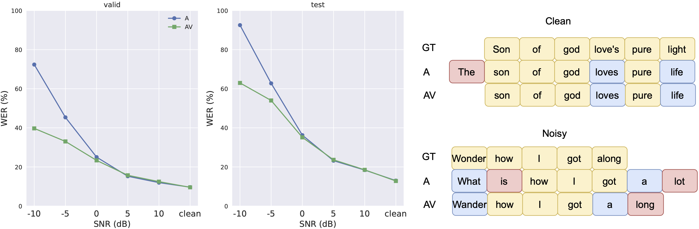

# Audio-Visual Automatic Lyric Transcription with N20EM

This sub-project contains recipes for training audio-visual ALT system using N20EM Dataset.

## Prerequisites
1. Before runnning our scripts, you need to download, preprocess and save the N20EM properly. For your convenience, we already crop the video clips of lip movements without releasing the identity of each subject.

The file organization for N20EM should be:
```
/path/to/N20EM
├── data
    ├── id1
        ├── downsample_audio.wav
        ├── downsample_accomp.wav
        ├── video.mp4
        ├── imu.csv
    ├── id2
    ├── ...
├── metadata_split_by_song.json
├── README.txt
```

2. Please refer to `recipes/N20EM/LM/README.md` to train and save language model before running following experiments. The trained RNNLM is saved at `/path/to/RNNLM`. To train the audio-only ALT system for N20EM dataset (w. DSing), please refer to `recipes/N20EM/ALT/README.md` to train a model on DSing dataset firstly.

## How to run
1. Firstly, we train our audio-only ALT system (check `N20EM/AudioALT/README.md`) and video-only ALT system (check `N20EM/VideoALT/README.md`). Make sure the model are well saved in order to extract features as follows.

2. Secondly, we fix the gradients of audio encoder and video encoder. In practice, we extract the acoustic features from audio-only ALT system. To achieve this, run following commands:
```
cd N20EM/AudioALT
CUDA_VISIBLE_DEVICES=0,1,2,3 python extract_wav2vec2_feats.py hparams/extract_wav2vec2_feats.yaml --data_parallel_backend --data_folder /path/to/n20em --pretrained_lm_path /path/to/RNNLM --pretrain_dsing True --attempt 2 --save_model True --add_noise True --noise_type <noise_type> --snr_db <snr_db> 
```

Compared to the run script, we enable four extra options. `--add_noise` refers to noisy input or clean input, while `--snr_db` refers to the noise level, including `-10`, `-5`, `0`, `5`, `10` dB. Finally, `--save_model==True` means that we will save the SSL model and ALT backend to the folder `N20EM/save_model` 

Then we extract the visual features from video-only ALT system. To achieve this, run following commands:

```
cd N20EM/VideoALT
CUDA_VISIBLE_DEVICES=0,1,2,3 python train_avhubert.py hparams/train_avhubert.yaml --data_parallel_backend --data_folder /path/to/n20em --pretrained_lm_path /path/to/RNNLM --save_feat True
```

3. Prepare csv files for N20EM feats, run:
```
cd AVALT
python prepare_feats.py --data_folder /path/to/n20em
```

4. Run the second training stage of audio-visual ALT system, run:
```
CUDA_VISIBLE_DEVICES=0,1,2,3 python train_fusion_av.py hparams/train_fusion_av.yaml --data_parallel_backend --data_folder /path/to/n20em --pretrained_lm_path /path/to/RNNLM --add_noise True --snr_db <snr_db>
```

We also provide counterpart audio-only ALT system trained via two stages, run:
```
CUDA_VISIBLE_DEVICES=0,1,2,3 python train_fusion_a.py hparams/train_fusion_a.yaml --data_parallel_backend --data_folder /path/to/n20em --pretrained_lm_path /path/to/RNNLM --add_noise True --snr_db <snr_db>
```

## Results
Results on N20EM dataset for audio-visual / audio-only ALT task under the perturbation of musical accompaniments:

<p align="center">

</p>