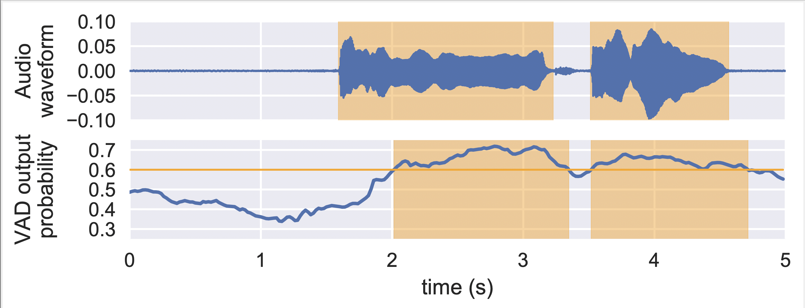

# Voice Activity Detection from IMU with N20EM
This sub-project contains recipes for implementing voice activity detection from IMU for the N20EM Dataset. We assume you have downloaded and pre-processed N20EM dataset. The N20EM dataset is saved at `/path/to/n20em`.

## How to run

To train the CRNN model, run the following command:
```
python main.py /path/to/IMU_VAD_data
```

`/path/to/IMU_VAD_data` is the path to save data for the task of Voice Activity Detection from IMU.


## Visualization
<p align="center">

</p>