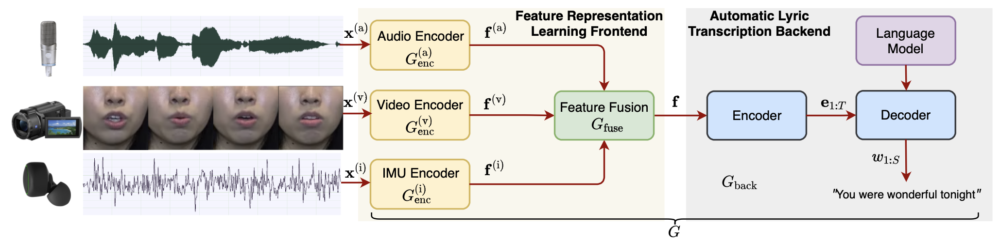

# MM-ALT: A Multimodal Automatic Lyric Transcription System
This is the author's official PyTorch implementation for MM-ALT. This repo contains code for experiments in the **ACM MM 2022 (Oral)** paper:

[MM-ALT: A Multimodal Automatic Lyric Transcription System](https://guxm2021.github.io/guxm.github.io/pdf/ACMMM2022.pdf)


## Project Description
Automatic lyric transcription (ALT) is a nascent field of study attracting increasing interest from both the speech and music information retrieval communities, given its significant application potential. However, ALT with audio data alone is a notoriously difficult task due to instrumental accompaniment and musical constraints resulting in degradation of both the phonetic cues and the intelligibility of sung lyrics. To tackle this challenge, we propose the MultiModal Automatic Lyric Transcription system (MM-ALT), together with a new dataset, N20EM, which consists of audio recordings, videos of lip movements, and inertial measurement unit (IMU) data of an earbud worn by the performing singer. 


## Method Overview
<p align="center">

</p>

## Installation
### Environement
Install Anaconda and create the environment with python 3.8.12, pytorch 1.9.0 and cuda 11.1:
```
conda create -n mmalt python=3.8.12
pip install torch==1.9.1+cu111 torchvision==0.10.1+cu111 torchaudio==0.9.1 -f https://download.pytorch.org/whl/torch_stable.html
```

### SpeechBrain

We run experiments based on [SpeechBrain toolkit](https://github.com/speechbrain/speechbrain). For simiplicity, we remove the original recipes. To install SpeechBrain, run following commands:
```
cd MM_ALT
pip install -r requirements.txt
pip install --editable .
```

[Transformers](https://github.com/huggingface/transformers) and other packages are also required:
```
pip install transformers
pip install datasets
pip install sklearn
```

### AV-Hubert
We adapt [AV-Hubert (Audio-Visual Hidden Unit BERT)](https://github.com/facebookresearch/av_hubert) in our experiments. To enable the usage of AV-Hubert, run following commands:
```
cd ..
git clone https://github.com/facebookresearch/av_hubert.git
cd av_hubert
git submodule init
git submodule update
```

[Fairseq](https://github.com/facebookresearch/fairseq) and dependencies are also required:
```
pip install -r requirements.txt
cd fairseq
pip install --editable ./
```

## Datasets
### DSing Dataset
[DSing dataset](https://www.isca-speech.org/archive_v0/Interspeech_2019/pdfs/2378.pdf) is one of the most popular singing datasets. To download and prepare this dataset, we follow its github website https://github.com/groadabike/Kaldi-Dsing-task.

The resulting folder should be organized as:
```
/path/to/DSing
├── dev
├── test
├── train1
├── train3
├── train30
```

### N20EM Dataset
N20EM dataset is curated by ourselves for our multimodal ALT task. The dataset is released here: https://zenodo.org/record/6905332#.Yz0zWC0Rr0o.

The resulting folder should be organized as:
```
/path/to/N20EM
├── data
    ├── id1
        ├── downsample_audio.wav
        ├── downsample_accomp.wav
        ├── video.mp4
        ├── imu.csv
    ├── id2
    ├── ...
├── metadata_split_by_song.json
├── README.txt
```

NOTE: Please make sure the audio input to model is 16 kHz and has mono-channel. The video input to model is 25 fps.

## Training and Evaluation
We follow the internal logic of SpeechBrain, you can run experiments in this way:
```
cd <dataset>/<task>
python experiment.py params.yaml
```
You may need to create csv files according to our guidance in `<dataset>/<task>`. The results will be saved in the `output_folder` specified in the yaml file. Both detailed logs and experiment outputs are saved there. Furthermore, less verbose logs are output to stdout.

## Citation
If you use MM-ALT or this codebase in your own work, please cite our paper:
```BibTex
@article{gu2022mm,
  title={MM-ALT: A Multimodal Automatic Lyric Transcription System},
  author={Gu, Xiangming and Ou, Longshen and Ong, Danielle and Wang, Ye},
  journal={arXiv preprint arXiv:2207.06127},
  year={2022}
}
```
We borrow the code from [SpeechBrain](https://arxiv.org/pdf/2106.04624.pdf), [Fairseq](https://arxiv.org/pdf/1904.01038.pdf), and [AV-Hubert](https://arxiv.org/pdf/2201.02184.pdf), please also consider citing their works.


## Also Check Our Relevant Work
**Transfer Learning of wav2vec 2.0 for Automatic Lyric Transcription**<br>
Longshen Ou*, Xiangming Gu*, Ye Wang<br>
*International Society for Music Information Retrieval Conference (ISMIR), 2022*<br>
[[paper](https://guxm2021.github.io/guxm.github.io/pdf/ISMIR2022.pdf)][[code](https://github.com/guxm2021/ALT_SpeechBrain)]

## License
MM-ALT is released under the Apache License, version 2.0.
